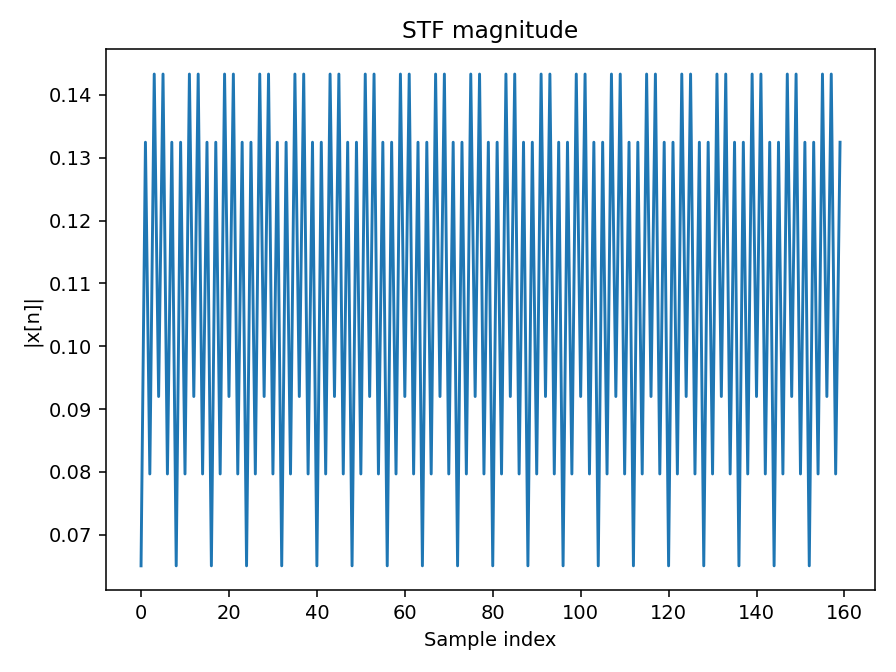
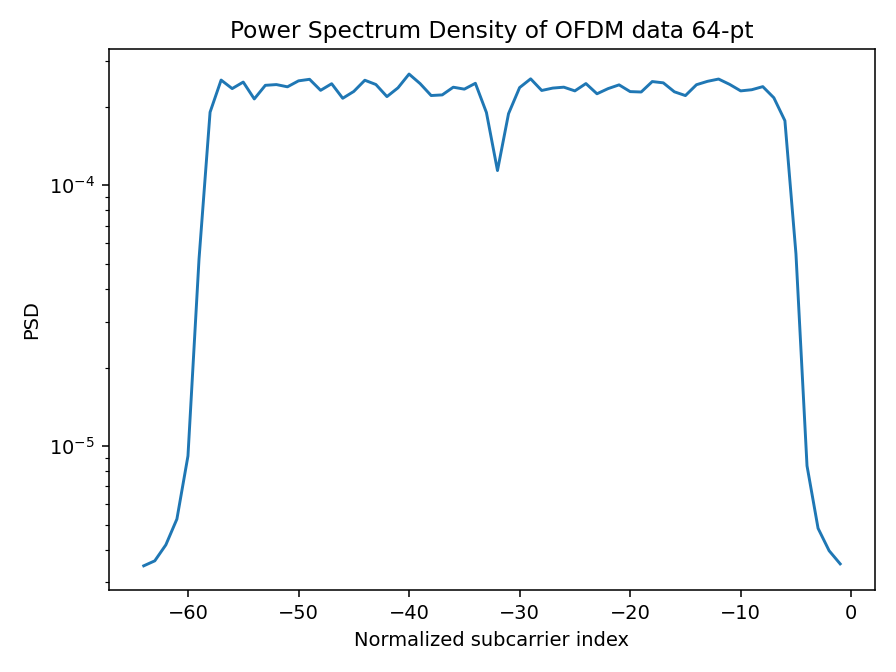
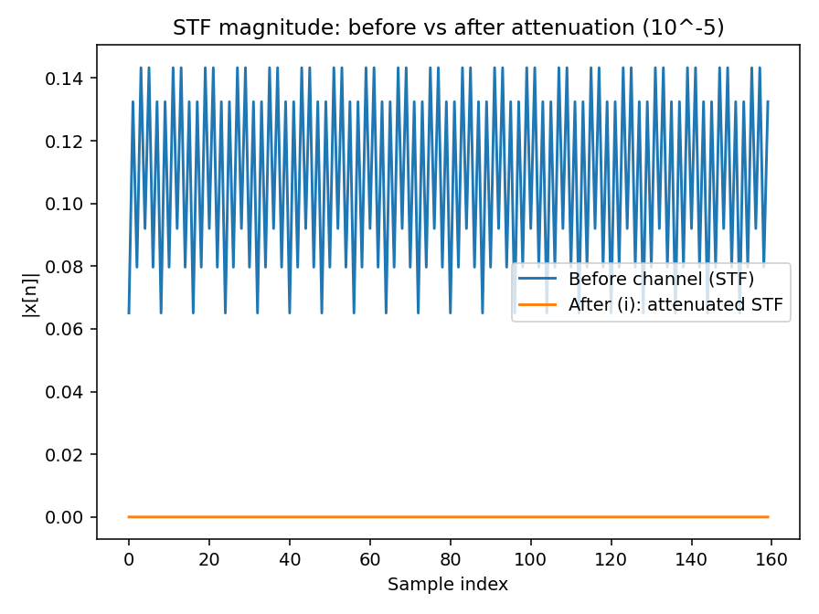
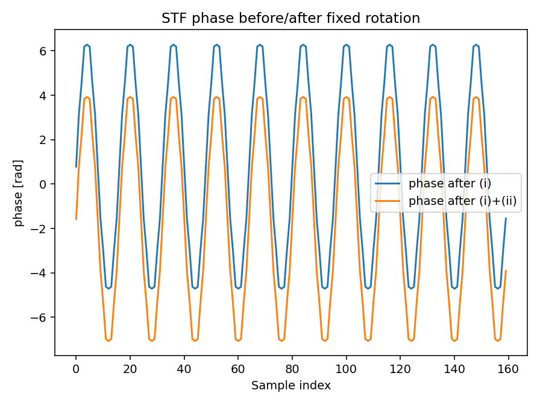
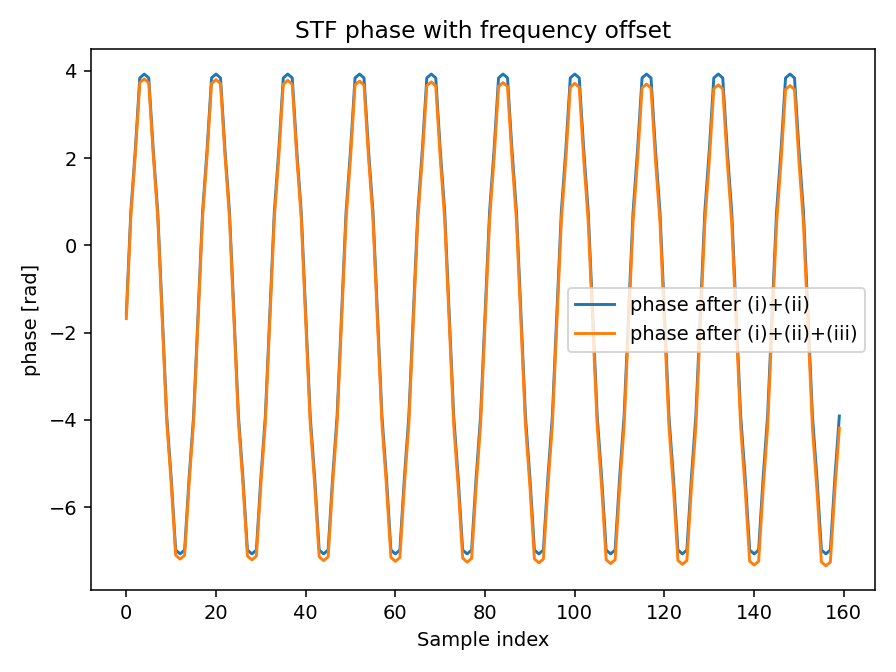
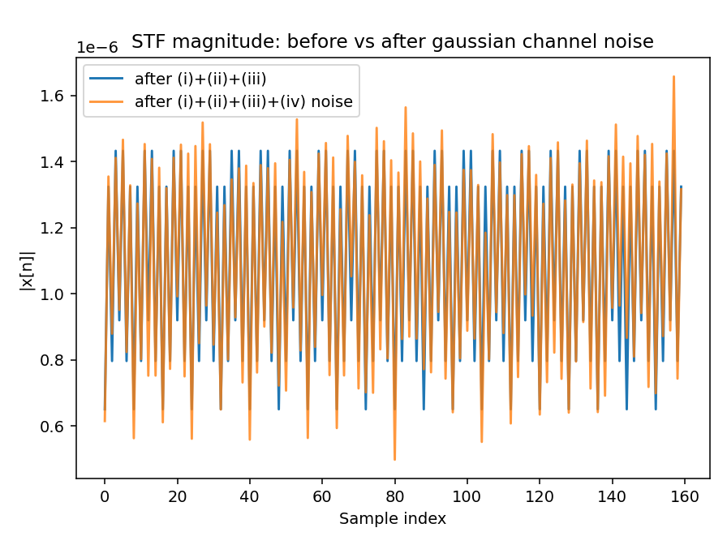
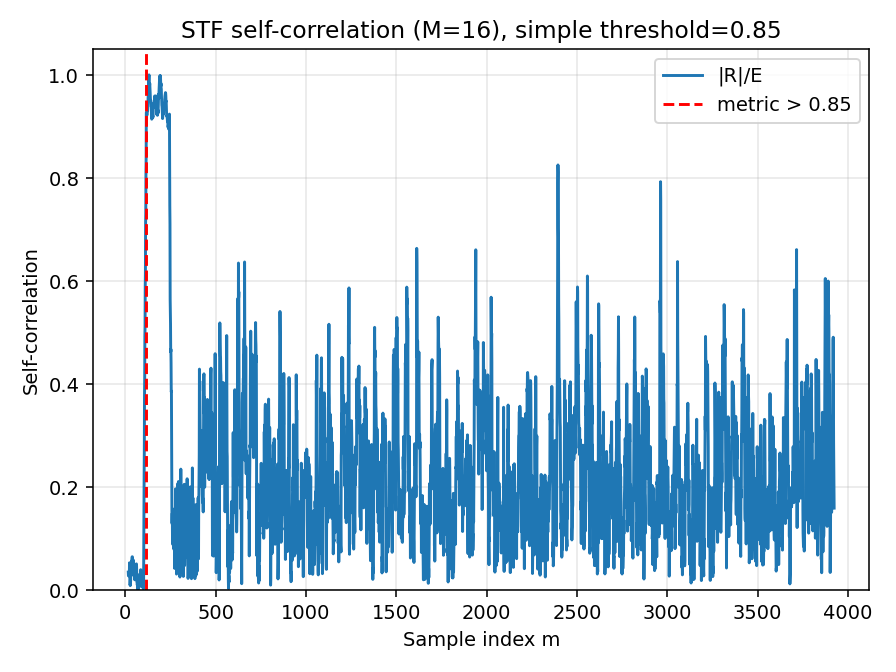
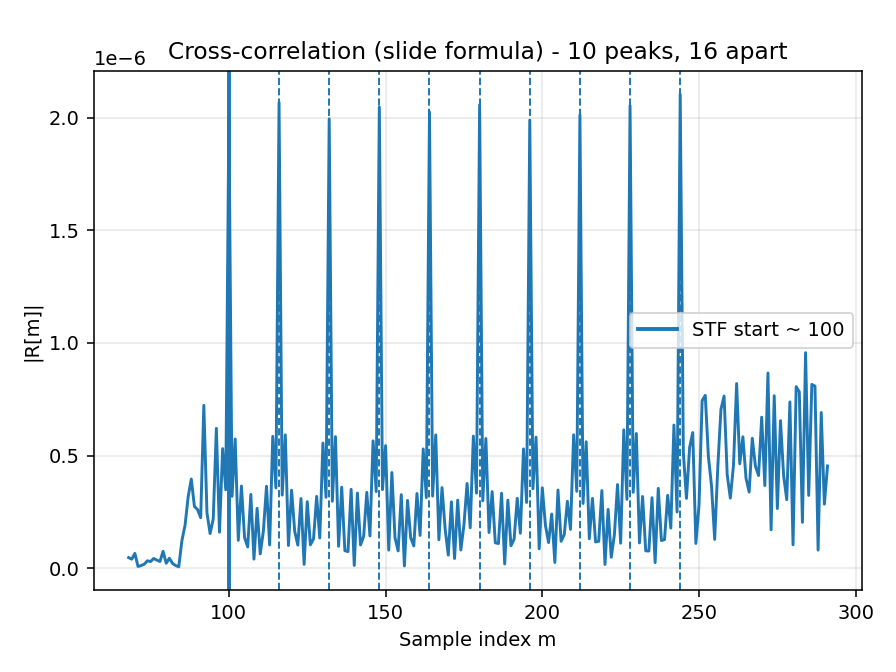

IEEE 802.11 OFDM baseband chain (STF/LTF preambles, IFFT/FFT, cyclic prefix, QPSK mapping) and simulates channel impairments including attenuation, phase rotation, carrier-frequency offset, and AWGN.

## What This Implements

1. Generate random packet bits (`4160` bits).
2. Map bits to QPSK symbols.
3. Pack symbols into OFDM frequency bins (`64` FFT, pilots at `[-21, -7, 7, 21]`).
4. OFDM modulation (IFFT + cyclic prefix `16`).
5. Build packet with STF + LTF preambles.
6. Apply channel impairments:
   - attenuation (`1e-5`)
   - phase rotation (`-3*pi/4`)
   - frequency offset (`0.00017` cycles/sample)
   - complex Gaussian noise (variance `1e-14`)
7. Detect packet using STF self-correlation.
8. Synchronize packet using STF cross-correlation.
9. Estimate CFO and channel from LTF.
10. Equalize and decode QPSK, compute BER.

## Project Structure

```text
ofdm_phy/
  constants.py         # Shared parameters, pilots, STF/LTF patterns
  transmitter.py       # Packet generation, QPSK mapping, OFDM TX, preambles
  channel.py           # Channel distortion stages (i)-(iv)
  synchronization.py   # Packet detection + synchronization
  receiver.py          # CFO/channel estimation + decode + BER
  plotting.py          # Plot generation and export
  pipeline.py          # End-to-end orchestration
run_ofdm.py            # CLI runner
ofdm.ipynb             # Original notebook
```

## Run

```bash
python run_ofdm.py
```

Optional:

```bash
python run_ofdm.py --packet-seed 123
```

Generated artifacts:

- `artifacts/run_summary.json`
- `artifacts/run_output.txt`
- `artifacts/plots/*.png`

## Latest Run Output (from this repo)

```text
OFDM simulation complete.
Packet length (bits): 4160
Number of OFDM symbols: 44
TX packet length (samples): 3840
Packet detection estimate: 116
Synchronization STF start index: 100
First five sync peaks: [100, 116, 132, 148, 164]
CFO estimate: 0.0001974646
Bit errors: 0
BER: 0.000000e+00
Summary JSON: artifacts/run_summary.json
Plot directory: artifacts/plots
```

## Plots

### STF Magnitude


### OFDM PSD (64-pt)


### Channel: Attenuation


### Channel: Fixed Phase Shift


### Channel: Frequency Offset


### Channel: Added Noise


### Packet Detection (Self-correlation)


### Packet Synchronization (Cross-correlation)

